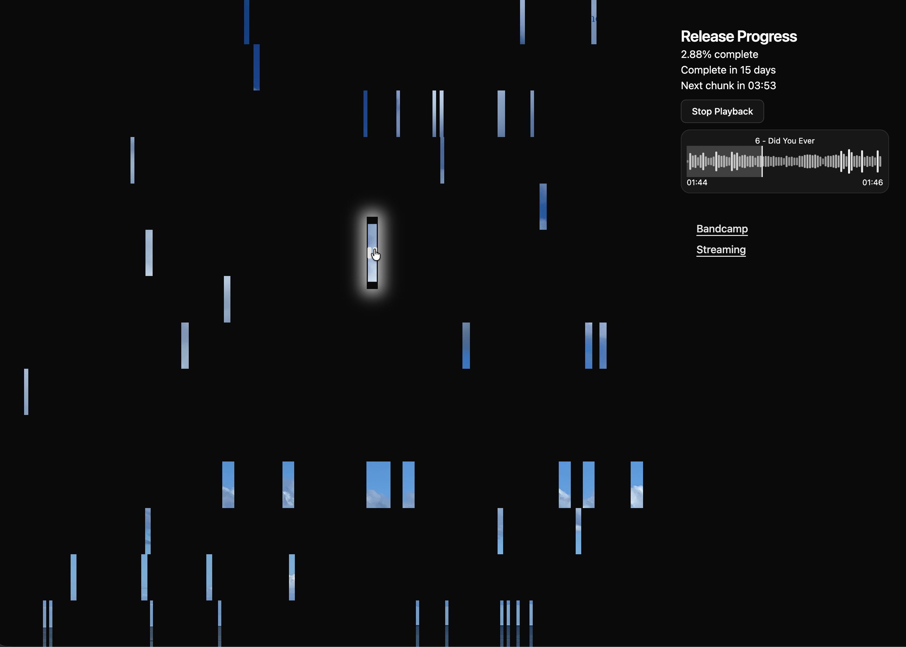

# Album Mosaic



A very silly way to tease an album release. Not in any way strategic,
but fun to make and hopefully fun to play with. My attempt at injecting
a bit of whimsy and delight in the often grueling grind of independent
musicians burning ourselves out on the hamster wheels of social media
and endless content creation.

## Live demo

My actual debut album release: https://bretthiggins.me/music

## To run locally

1. Clone the repo
1. `npm install`
1. Get some sample audio files and an album cover image
   - For my testing, before my album was done, I used the wonderful
     [Mouth Dreams] album by Neil Cicierega
1. Drop those files in the `media` directory:
   ```
   media/<album_name>/
     audio/
       01 - Track One.mp3
       02 - Track Two.mp3
       ...
     Cover.jpg
   ```
1. Create a file named `build/metadata.manual.json` with these contents:
   - Release timestamps, which determine the rate at which new segments are released
     - `releaseStart`: release start timestamp (ISO 8601)
     - `releaseEnd`: release end timestamp (ISO 8601)
   - `artist`: Artist name (used in the pre-release notice)
   - `album`: Album name (used in the pre-release notice)
   - `links`: an object describing links to show on the page:
     - Keys are link labels
     - Values are objects with these keys:
       - `url`: the URL to link to
       - `date`: the date after which the link will be displayed (default is `releaseEnd`)
1. Run `npm run split -- --image media/<album_name>/Cover.jpg --audio-dir media/<album_name>/audio
   - This will do the following:
     - Split the audio files into randomly-named 1-second files
     - Slice up the image into one strip per track and each track into one image segment per audio segment
     - Generate a `metadata.json` file 
   - Use `--chunk-size <seconds>` to change it from the default of `1`
1. Run `npm run deploy-metadata:dev` to create a local R2 bucket to store `metadata.json`
1. Run `npm start` and open the URL displayed

I may have missed a [wrangler] setup step somewhere in there. You'll definitely need to configure
wrangler with your Cloudflare account to actually deploy this app to Cloudflare; for now, that's
left as an exercise for the reader.

[Mouth Dreams]: http://www.neilcic.com/mouthdreams/
[wrangler]: https://developers.cloudflare.com/workers/wrangler/

## Learnings

I discovered way too late in this project that Cloudflare would not let
me point my own domain at a worker site; it has to be in a zone managed
by Cloudflare. This made me a sad panda, and may lead me to making another
attempt with Vercel or Netlify, both of which I tried first before encountering
limitations, bugs, or other weird behaviors that made me uneasy or stuck.

Now that I've finished the first full version of the app, though, it might
be worth taking another look, as both Vercel and Netlify allow custom domains
on their free plans. The AWS free tier (with Serverless or another framework
to make Lambda + S3 easier) might be worth a try as well.
